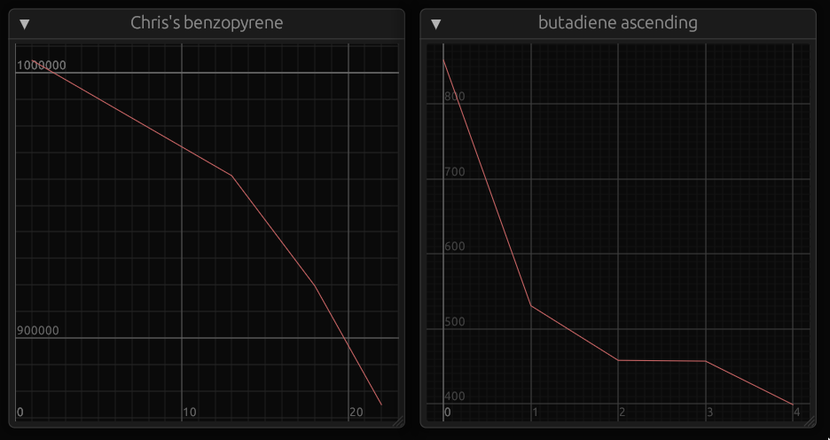

# dash
dashboard for tracking pbqff and rust-semp jobs



# Installation

```shell
make build
sudo make install
```

## Dependencies
- rust nightly toolchain
- scp
- ssh key for each `host` entry in the config file
- make

Somewhat obviously, `make` is only needed to run the commands above. If you want
to use cargo and put the binary somewhere on your `$PATH` yourself, you don't
need it.

# Usage

```shell
dash [edit | INFILE]
```

Without the optional input file, `dash` searches for
`$HOME/.config/dash/config.toml`, which has the format:

```text
[[project]]
name = "Project name"
host = "project-host-name"
path = "path/on/host/pbqff.log"
type = "pbqff"

[[project]]
name = "Another project"
host = "another-host"
path =  "another/path/semp.out"
type = "semp"
```

`name` can be any string, `host` should be the hostname of the server you want
to SSH/SCP files from, and `path` is the path to the appropriate output file at
that path. `type` is currently either "pbqff" or "semp".

You can also run `dash edit` to launch `$EDITOR` on the default config file.
